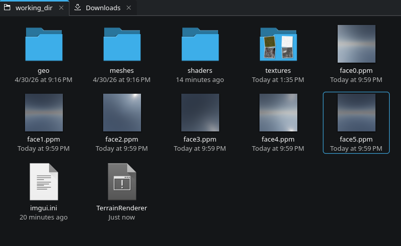
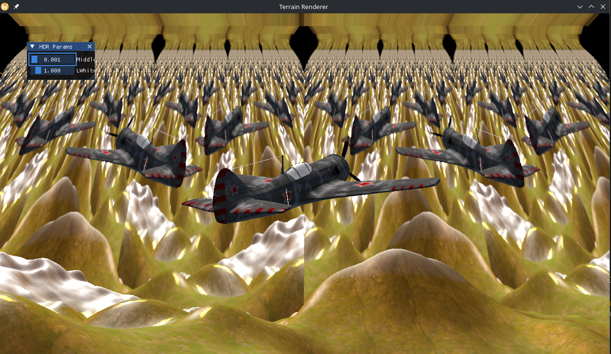
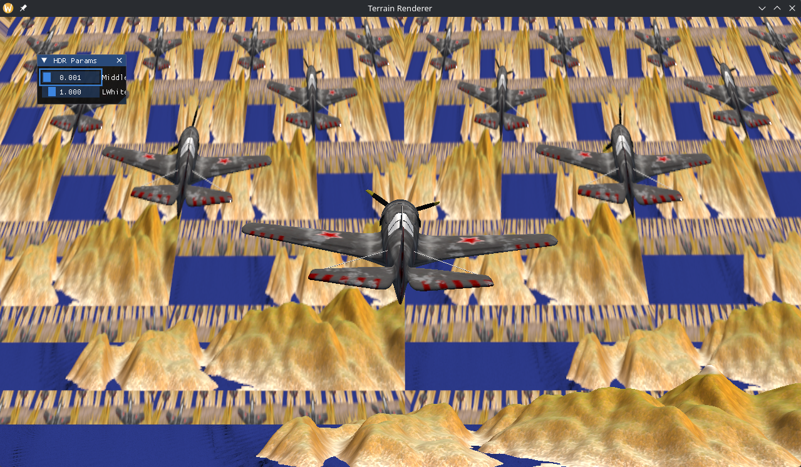
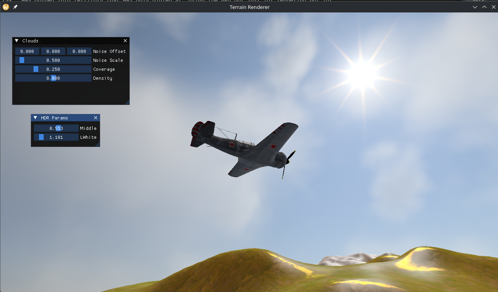
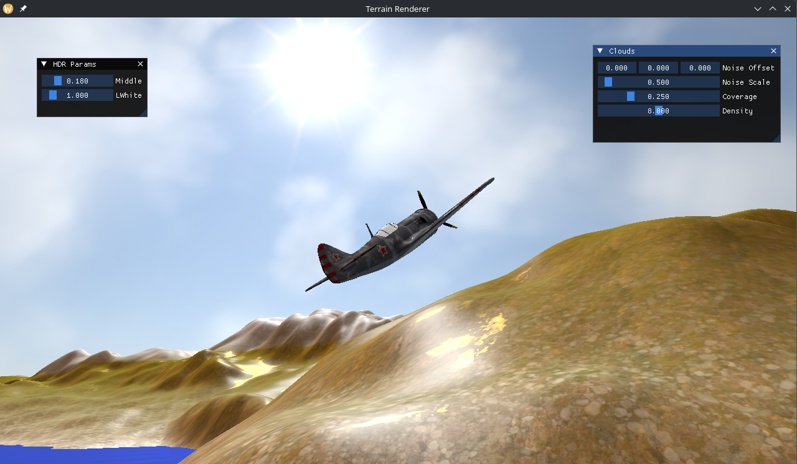

# HW3: Rain Effect and Volumetric Rendering

## Introduction

This is the third assignment of CENG 469 Computer Graphics 2, building directly on top of the environment mapping renderer from HW2. The goal was to convert the HDR equirectangular sky into a proper cubemap, add procedurally generated volumetric clouds shaded with ray marching, and implement a rain particle system. Rain did not make it into my final submission due to time constraints, but the algorithm is well understood and a similar system will be built for the term project's missile and explosion effects probably (if not I will try to add a proper rain effect to the project).

The topics covered in this post, roughly in the order I implemented them:

- Architecture: hw3.cpp alongside hw2.cpp without touching it
- HDR equirectangular → cubemap via compute shader
- Mesa/Intel driver bugs encountered and fixed
- Volumetric clouds with Perlin noise and single-scattering ray marching
- Rain particle system design (not implemented, but explained)

---

## Architecture

My first decision was to use the starter code our assistant gave and keep HW2 completely untouched as he did for HW1 for it. I created `src/hw3.h` and `src/hw3.cpp` as a completely separate orchestrator. The `HW3` struct owns its own HDR framebuffer, the baked sky cubemap, cloud parameters, and the render loop. `main.cpp` instantiates `HW3` and calls its `Work()` function each frame.

The scene geometry classes (`Terrain_v2`, `Plane`, `Water`) from HW2 are reused as-is — they are just asset containers holding meshes and textures. HW2's own `Render()` functions are never called and HW2 is not modified at all. Instead, HW3 has its own `RenderTerrain` / `RenderWater` / `RenderPlane` methods that reuse each object's vertex program, mesh, and material textures, but bind the baked `CubemapGL` and use HW3's own `*_cube.frag` shaders — so the lighting samples a `samplerCube` instead of the `sampler2D` equirectangular map.

I also added a `CubemapGL` struct to `utility.h` alongside the existing `TextureGL`. It allocates a `GL_TEXTURE_CUBE_MAP` with `GL_RGBA32F` format and a full mip chain. (Four channels are required because the compute shader writes the cubemap through `imageStore`, and GL image units do not support three-channel formats like `RGB32F`.)

```cpp
struct CubemapGL
{
    GLuint textureId = 0;
    int    faceSize  = 0;

    CubemapGL(int faceSize);
    ~CubemapGL();
    // non-copyable, movable
};
```

The cubemap is baked once at startup and again whenever the user changes a cloud parameter (dirty flag). This way the cloud re-bake does not happen every frame.

---

## HDR → Cubemap via Compute Shader

The reference implementation approach was to use a compute shader where each invocation processes exactly one cubemap texel. The dispatch is:

```cpp
glDispatchCompute(faceSize / 8, faceSize / 8, 6);
// shader: layout(local_size_x = 8, local_size_y = 8, local_size_z = 1) in;
// gl_GlobalInvocationID.z = face index (0=+X … 5=-Z)
```

Inside the shader, each invocation converts its `(face, x, y)` coordinates to a normalized `[-1, 1]` UV, builds the world-space direction for that cubemap face using the standard OpenGL face-direction table, converts that direction to equirectangular UV, samples the HDR texture, composites clouds on top, and writes the result with `imageStore`.

The face direction table follows the OpenGL cubemap convention (left-handed coordinate system as inherited from RenderMan):

```glsl
vec3 FaceDirection(uint face, vec2 uv)
{
    if(face == 0u) return vec3(  1.0, -uv.y, -uv.x); // +X
    if(face == 1u) return vec3( -1.0, -uv.y,  uv.x); // -X
    if(face == 2u) return vec3( uv.x,  1.0,  uv.y);  // +Y
    if(face == 3u) return vec3( uv.x, -1.0, -uv.y);  // -Y
    if(face == 4u) return vec3( uv.x, -uv.y,  1.0);  // +Z
    return                vec3(-uv.x, -uv.y, -1.0);  // -Z
}
```

After the bake, `glGenerateMipmap(GL_TEXTURE_CUBE_MAP)` produces the full mip chain for LOD sampling in the scene shaders. The sky background shader reconstructs the world-space view ray per pixel using the inverse view rotation matrix and samples the cubemap directly with `textureLod(skyCubemap, dir, 0.0)`.

To verify the bake was producing correct results independently of the sampling bug, I dumped all six cubemap faces to PPM files at startup. The face dump confirmed the directions were correct — each face showed the expected portion of the sky.



### Mesa / Intel Driver Issues

Getting this to work on Linux with Mesa Intel drivers turned out to be most of the debugging time. Several driver-specific issues appeared that did not occur on Windows:

The symptom was bizarre: instead of the sky, the background filled with a tiled, mirrored *army of planes*. The sky's `samplerCube` was not sampling the cubemap at all — it was reading the tonemapper's 2D color texture (the previous frame's rendered scene) off the shared texture unit, so every frame fed its own output back into the background and multiplied the plane endlessly across the horizon. The eerie, repeating result reminded me of the upcoming game *Control Resonant*.

<p align="center">
  
  
</p>

Tracking it down revealed several distinct Mesa-specific problems stacked on top of each other. Here is each one and the fix that resolved it.

**Texture unit collision.** This was the cause of the army of planes. The tonemapper bound `frameColorTex` (a `GL_TEXTURE_2D`) to unit 0 at the end of each frame. The next frame, the sky background bound `skyCubemap` (a `GL_TEXTURE_CUBE_MAP`) to the same unit 0. While OpenGL technically allows a unit to host bindings of different targets simultaneously, Mesa's Intel driver failed the texture completeness check and sampled the 2D target instead of the cube target — so the `samplerCube` returned the previous frame's rendered scene rather than the HDR sky. Fix: move the tonemapper's framebuffer texture to unit 15, isolating it from the cubemap on unit 0, and unbind textures at the end of each pass so nothing lingers between frames.

**`imageSize()` returning zero on `writeonly` images.** The original shader queried the cubemap face size with `imageSize(uCube).xy`. On Intel Mesa, `writeonly` image descriptors do not bind the read side, so `imageSize()` returns `(0, 0)`. The early-exit guard `if(texel >= size) return;` then fired for every thread, leaving the cubemap entirely black. Fix: pass the face size as a uniform `int uFaceSize` from the CPU instead.

**Separable pipeline interfering with compute dispatch.** Binding the bake compute shader through `glUseProgramStages` on the separable pipeline caused Mesa to misresolve layout bindings. Fix: use `glUseProgram(bakeCompute.shaderId)` directly for the bake dispatch, then restore `glUseProgram(0)` afterwards.

---

## Volumetric Clouds

Clouds are generated entirely inside `equirectToCubemap.comp` — no separate pass. While converting the equirectangular HDR to the cubemap, the shader also ray-marches through a procedural cloud volume and composites the result over the sky color before writing to the cubemap face. Because the cubemap is only rebaked when parameters change, this expensive step does not affect frame rate during normal navigation.

### Perlin Noise and Turbulence

The cloud density field is built from fractional Brownian motion (fBm) over 3D Perlin noise, following the course slides. Perlin noise uses the gradient vectors and permutation table from the slides:

```glsl
vec3 gradients[16] = {
    vec3(1,1,0), vec3(-1,1,0), vec3(1,-1,0), vec3(-1,-1,0),
    vec3(1,0,1), vec3(-1,0,1), vec3(1,0,-1), vec3(-1,0,-1),
    vec3(0,1,1), vec3(0,-1,1), vec3(0,1,-1), vec3(0,-1,-1),
    vec3(1,1,0), vec3(-1,1,0), vec3(0,-1,1), vec3(0,-1,-1)
};
int table[16] = { 0,1,2,3,4,5,6,7,8,9,10,11,12,13,14,15 };
```

For each lattice corner, the gradient index is found by hashing the integer corner coordinates through the permutation table. Each corner contributes `dot(gradient, offset)`, where `offset` is the vector from that corner to the sample point. The eight corner dot products are then **trilinearly interpolated** using the smoothed fractional coordinates `u = f(dx)`, `v = f(dy)`, `w = f(dz)` (mix along x, then y, then z), where `f(t) = 6t^5 - 15t^4 + 10t^3` is Perlin's fade polynomial.

fBm accumulates four octaves with halving amplitude and doubling frequency (turbulence), as described in the slides:

```glsl
float fbm(vec3 p)
{
    float v = 0.0, a = 0.5;
    for(int i = 0; i < 4; ++i) { v += a * abs(perlin(p)); p *= 2.0; a *= 0.5; }
    return v;
}
```

The final cloud density thresholds the fBm value against a `coverage` parameter using `smoothstep`, so the user can control how much of the sky is covered.

### Ray Marching with Single Scattering

The course slides describe ray marching through a horizontal cloud slab bounded by altitude values. I chose to march every direction a fixed distance instead, which makes clouds appear uniformly across the entire sky sphere. This is a design choice — the core ray marching and single scattering logic remains the same.

For each cubemap direction, the shader marches the ray a fixed distance in equal steps. At each step it queries the cloud density, and if nonzero, computes the contribution of sunlight scattered toward the viewer:

```glsl
for(int i = 0; i < STEPS; ++i)
{
    vec3 p = dir * ((float(i) + 0.5) * stepSize);
    float dens = cloudDensity(p);
    if(dens > 0.001)
    {
        float sigma = dens * uDensity;
        vec3 light = lightMarch(p) * phase * sunCol + ambient;
        scatter += transmittance * sigma * stepSize * light;
        transmittance *= exp(-sigma * stepSize);
        if(transmittance < 0.01) break;
    }
}
return sky * transmittance + scatter;
```

`lightMarch` does a short secondary march toward the sun direction to compute self-shadowing transmittance. The angular distribution of scattered light uses the Henyey-Greenstein phase function, which models forward scattering with a single asymmetry parameter `g`. The sun direction is found on the CPU by scanning the HDR pixels for the maximum luminance and converting that pixel's UV back to a world-space direction.

All parameters — noise offset, noise scale, coverage, density — are exposed in an ImGui panel and trigger a cubemap rebake when changed.

---

## Rain Particle System

Rain was not implemented in this submission. However, the algorithm from the assignment specification is clear and worth explaining.

The particle system lives entirely on the GPU. A large buffer is allocated once and bound as a Shader Storage Buffer Object (SSBO). Each entry holds the particle's position, velocity, state (ALIVE, DEAD, or SPLASHING), and a per-particle random seed. Using a per-particle seed is critical: compute shader invocations run in parallel, and a single shared random state would cause race conditions where multiple threads read and write the same value simultaneously.

Each frame, a compute shader dispatches one invocation per particle. ALIVE particles fall downward. Their world position is projected to Normalized Device Coordinates (NDC) and compared against the value sampled from the depth buffer at that screen position. If the particle's NDC depth is close to the scene depth, a collision is detected and the state changes to SPLASHING. SPLASHING particles advance through the frames of the sprite sheet animation (the `Splash.png` texture, which is a 128×32 image containing four 32×32 frames side by side) and then transition to DEAD. DEAD particles respawn at a random position on top of a cube volume that follows the camera, becoming ALIVE again.

For rendering, an empty VAO is used with no vertex attributes. A draw call launches one vertex per particle; the vertex shader reads the particle's position and state from the SSBO using `gl_VertexID`. The geometry shader receives a point and emits a quad (two triangles) that always faces the camera horizontally but not vertically, giving the droplets a streak appearance. The fragment shader selects the correct sub-texture from the sprite sheet based on the particle's state and animation frame counter.

---

## Conclusion

HW3 pushed into territory that HW2 only hinted at: using the GPU not just for rendering but for general computation (the cubemap bake, cloud ray marching and rain particles). The Mesa driver debugging was unexpectedly time-consuming but ended up being a good lesson in how much driver behavior varies across platforms, and how to write defensive OpenGL code that works everywhere.

Below are some screenshots of the final scene.




---

<p align="center"><em>Thanks for reading. See you next time, take care.</em></p>